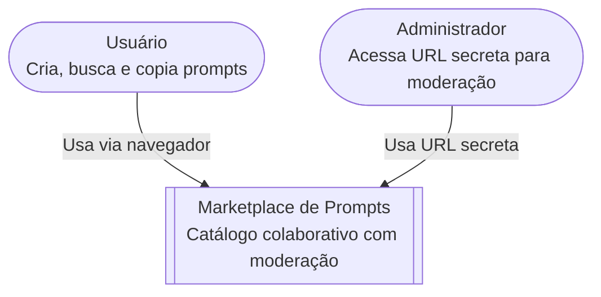
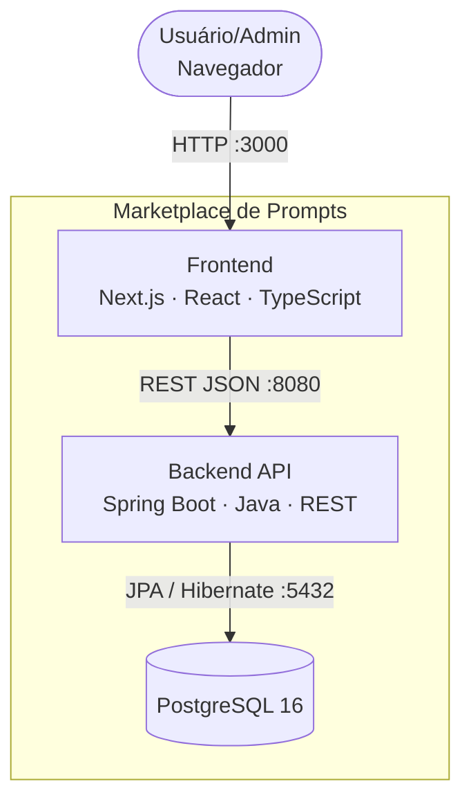
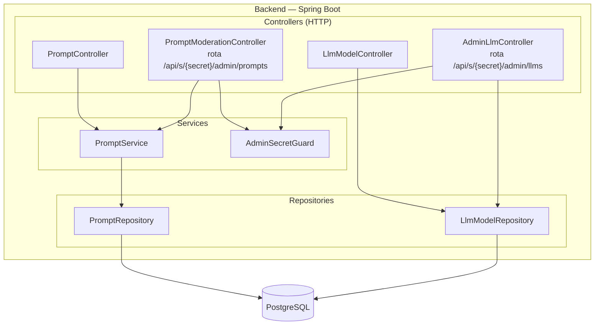
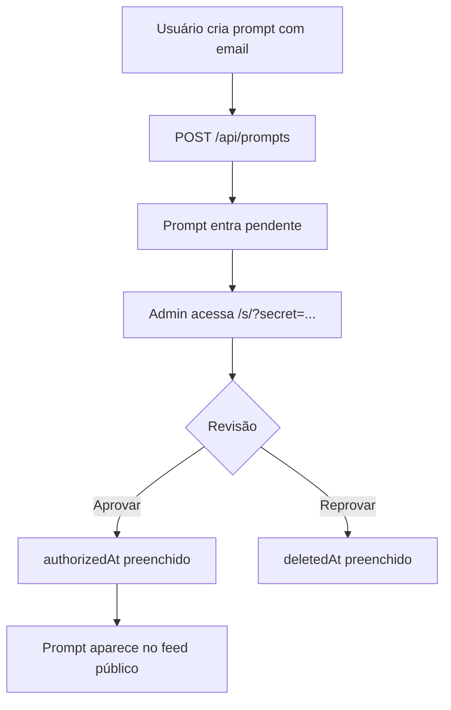
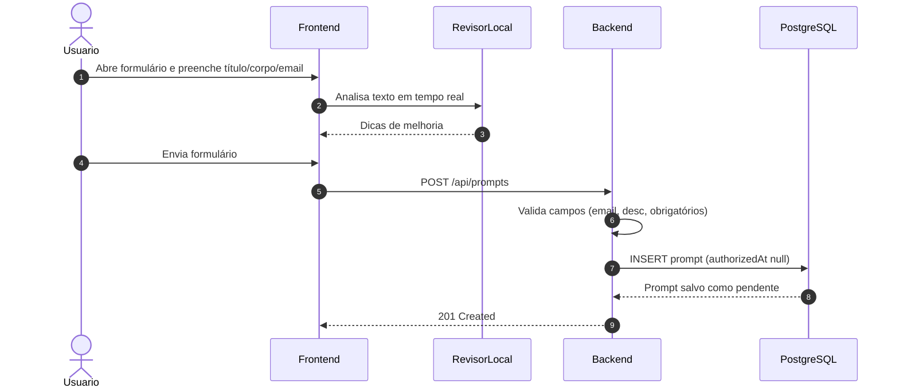
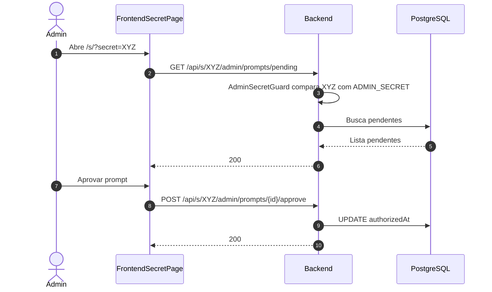
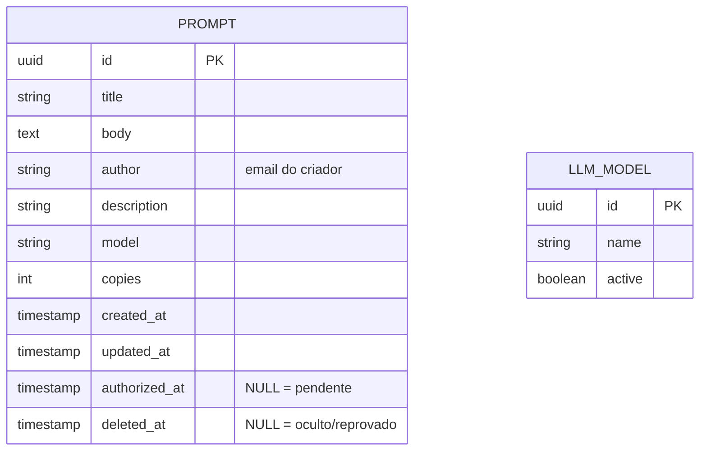
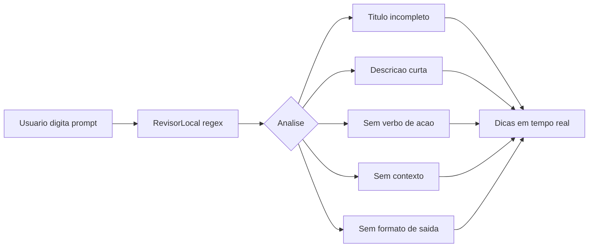
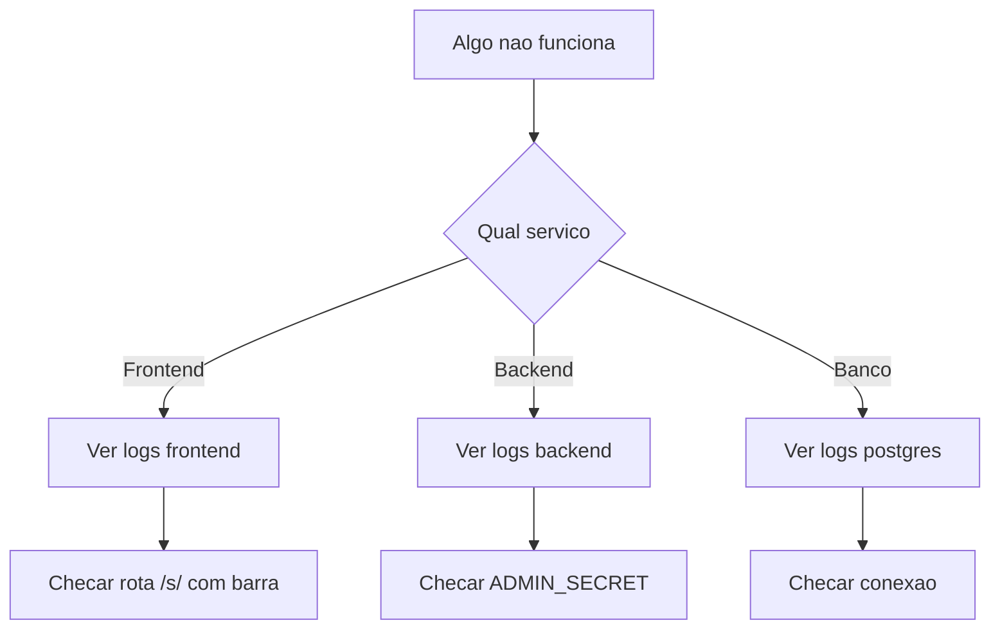
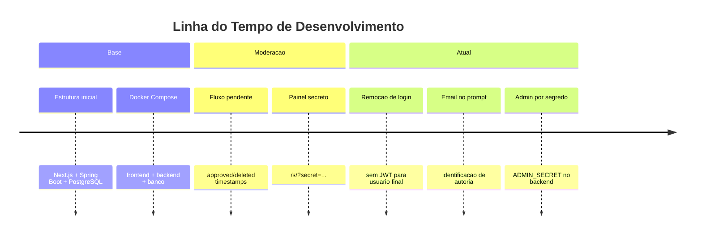

<div align="center">

# Marketplace de Prompts

[](https://nextjs.org/)
[](https://spring.io/projects/spring-boot)
[](https://www.postgresql.org/)
[](https://www.docker.com/)
[](https://www.typescriptlang.org/)

**Catálogo colaborativo de prompts com moderação e URL secreta de administração (sem login de usuário).**

</div>

---

## Execução Rápida com Docker

```bash
# 1. Suba tudo
docker compose up --build -d

# 2. Acesse
# Frontend  → http://localhost:3000
# Backend   → http://localhost:8080
# Banco     → localhost:5432

# 3. Para encerrar
docker compose down
```

### URL secreta de admin

- O backend valida o segredo via `ADMIN_SECRET` (default `change-me`).
- No frontend, o painel admin fica em:
  - `http://localhost:3000/s/?secret=<SEU_ADMIN_SECRET>`
- O mesmo valor é usado nas rotas:
  - `/api/s/{SECRET}/admin/prompts/...`
  - `/api/s/{SECRET}/admin/llms/...`

> Em produção, use um segredo forte e trate a URL como credencial.

---

## Índice

- [Visão Geral](#visão-geral)
- [Arquitetura C4](#arquitetura-c4)
- [Fluxo de Prompts e Moderação](#fluxo-de-prompts-e-moderação)
- [Diagrama de Sequência — Criação de Prompt](#diagrama-de-sequência--criação-de-prompt)
- [Diagrama de Sequência — Moderação Admin (URL Secreta)](#diagrama-de-sequência--moderação-admin-url-secreta)
- [Modelo de Dados](#modelo-de-dados)
- [API Principal](#api-principal)
- [Funcionalidades](#funcionalidades)
- [Agente Revisor Local](#agente-revisor-local)
- [Validações e Regras de Negócio](#validações-e-regras-de-negócio)
- [Desenvolvimento Local](#desenvolvimento-local)
- [Estrutura do Repositório](#estrutura-do-repositório)
- [Troubleshooting](#troubleshooting)
- [Release Notes](#release-notes)

---

## Visão Geral

O **Marketplace de Prompts** é um catálogo vivo — não uma lista estática. Ele combina:

| Pilar | O que entrega |
|-------|--------------|
| **Descoberta** | Busca textual, filtro por categoria, autocomplete e paginação |
| **Criação** | Formulário com revisor em tempo real e campo de e-mail obrigatório |
| **Moderação** | Fila de aprovação via URL secreta de admin |
| **Segurança Operacional** | Segredo em `ADMIN_SECRET`, sem login/JWT de usuário |
| **Métricas** | Contador de cópias por prompt |

---

## Arquitetura C4

### Nível 1 — Contexto do Sistema



---

### Nível 2 — Containers



---

### Nível 3 — Componentes do Backend



---

## Fluxo de Prompts e Moderação



---

## Diagrama de Sequência — Criação de Prompt



---

## Diagrama de Sequência — Moderação Admin (URL Secreta)



---

## Modelo de Dados



> `authorized_at = NULL` indica prompt pendente de moderação.  
> `deleted_at != NULL` indica soft delete.

---

## API Principal

**Base URL:** `http://localhost:8080`

### Prompts

| Método | Endpoint | Descrição |
|--------|----------|-----------|
| `GET` | `/api/prompts` | Lista prompts aprovados e ativos |
| `POST` | `/api/prompts` | Cria novo prompt pendente (inclui `email`) |
| `POST` | `/api/prompts/{id}/copy` | Incrementa contador de cópias |

### Moderação (URL secreta)

| Método | Endpoint | Descrição |
|--------|----------|-----------|
| `GET` | `/api/s/{SECRET}/admin/prompts/pending` | Lista prompts pendentes |
| `POST` | `/api/s/{SECRET}/admin/prompts/{id}/approve` | Aprova prompt |
| `POST` | `/api/s/{SECRET}/admin/prompts/{id}/reject` | Reprova prompt |

### LLMs

| Método | Endpoint | Descrição |
|--------|----------|-----------|
| `GET` | `/api/llms` | Lista LLMs ativas para uso no formulário |
| `GET` | `/api/s/{SECRET}/admin/llms` | Lista todas as LLMs (admin) |
| `POST` | `/api/s/{SECRET}/admin/llms` | Cadastra LLM |
| `DELETE` | `/api/s/{SECRET}/admin/llms/{id}` | Remove ou inativa LLM |

---

## Funcionalidades

### Público geral

- Busca textual em tempo real
- Filtro por categoria/tag com autocomplete
- Paginação da listagem
- Tema claro/escuro
- Criação de prompt com email e moderação
- Copiar prompt com contador
- Expansão de cards e modal de visualização

### Painel admin secreto

- Aprovação/reprovação de prompts pendentes
- Cadastro e inativação de LLMs

---

## Agente Revisor Local

O revisor analisa o prompt **100% no frontend**, sem chamadas externas ou chave de API.



---

## Validações e Regras de Negócio

| Regra | Escopo |
|-------|--------|
| Título obrigatório | Frontend + Backend |
| Corpo obrigatório | Frontend + Backend |
| Descrição curta obrigatória (`desc`) | Frontend + Backend |
| Email válido (`@Email`) | Frontend + Backend |
| Prompt criado entra pendente (`authorizedAt = null`) | Backend |
| Cópia só para prompt aprovado e ativo | Backend |
| Segredo inválido retorna `HTTP 403` nas rotas admin | Backend |

---

## Desenvolvimento Local

### Backend

```bash
cd backend
export SPRING_DATASOURCE_URL=jdbc:postgresql://localhost:5432/promptvault
export SPRING_DATASOURCE_USERNAME=postgres
export SPRING_DATASOURCE_PASSWORD=postgres
export ADMIN_SECRET=change-me
./mvnw spring-boot:run
```

### Frontend

```bash
cd frontend
npm install
export NEXT_PUBLIC_API_URL=http://localhost:8080/api
npm run dev
```

### Testes

```bash
cd backend && ./mvnw test
cd frontend && npm test
```

**Fluxo de validação manual recomendado:**

1. Criar prompt com email válido
2. Verificar que não aparece no feed antes da aprovação
3. Acessar `/s/?secret=...`
4. Aprovar/reprovar prompt
5. Validar listagem pública após aprovação
6. Validar cadastro/inativação de LLM

---

## Estrutura do Repositório

```text
prompt-vault/
├── frontend/           # Next.js + React + TypeScript
│   ├── src/
│   │   ├── app/        # rotas (/, /s)
│   │   ├── components/
│   │   ├── context/
│   │   └── data/
│   └── Dockerfile
│
├── backend/            # Spring Boot + Java
│   ├── src/main/java/
│   │   ├── prompt/
│   │   ├── llm/
│   │   ├── admin/
│   │   └── config/
│   └── Dockerfile
│
└── docker-compose.yml
```

---

## Troubleshooting

### Fluxo de Diagnóstico



---

### Docker — Diagnóstico Geral

```bash
docker compose ps
docker compose logs -f
docker compose logs -f frontend
docker compose logs -f backend
docker compose logs -f postgres
```

---

### Frontend — Diagnóstico

```bash
docker compose logs -f frontend
curl -I http://localhost:3000/
curl -I "http://localhost:3000/s/?secret=change-me"
```

Erros comuns:

| Erro | Causa provável | Solução |
|------|----------------|---------|
| `This page could not be found` em `/s` | Acesso sem barra final | Use `/s/?secret=...` |
| Painel sem dados | `secret` errado | Confirmar `ADMIN_SECRET` no backend |
| `ECONNREFUSED 8080` | Backend fora | Reiniciar backend |

---

### Backend — Diagnóstico

```bash
docker compose logs -f backend
curl -v http://localhost:8080/api/prompts
curl -v "http://localhost:8080/api/s/change-me/admin/prompts/pending"
```

Erros comuns:

| Erro / Log | Causa provável | Solução |
|------------|----------------|---------|
| `403 Sem permissao` | Secret incorreto | Usar mesmo valor do `ADMIN_SECRET` |
| `Could not resolve placeholder` | Env faltando | Definir `ADMIN_SECRET` |
| `Port 8080 already in use` | Porta ocupada | Liberar porta ou alterar mapeamento |

---

### Banco de Dados — Diagnóstico

```bash
docker compose exec postgres psql -U postgres -d promptvault
```

```sql
\dt
SELECT id, title, author, authorized_at, deleted_at FROM prompts ORDER BY created_at DESC;
```

---

### Checklist de Diagnóstico Rápido

```text
1. docker compose ps
2. docker compose logs --tail=50 frontend
3. docker compose logs --tail=50 backend
4. curl http://localhost:8080/api/prompts
5. abrir /s/?secret=<ADMIN_SECRET>
```

---

## Release Notes



---

*Para novos colaboradores: comece por Execução Rápida, Fluxo de Moderação e API Principal.*
