<div align="center">

# Marketplace de Prompts

[](https://nextjs.org/)
[](https://spring.io/projects/spring-boot)
[](https://www.postgresql.org/)
[](https://www.docker.com/)
[](https://jwt.io/)
[](https://www.typescriptlang.org/)

**Catálogo colaborativo de prompts com moderação, autenticação e foco total em produtividade.**

</div>

---

## Execução Rápida com Docker

```bash
# 1. Clone e suba tudo com um comando
docker compose up --build -d

# 2. Acesse
# Frontend  → http://localhost:3000
# Backend   → http://localhost:8080
# Banco     → localhost:5432

# 3. Para encerrar
docker compose down
```

> **Credencial admin seed:** `admin@admin.com` / `admin`

---

## Índice

- [Visão Geral](#visão-geral)
- [Arquitetura C4](#arquitetura-c4)
- [Fluxo de Autenticação](#fluxo-de-autenticação)
- [Fluxo de Prompts e Moderação](#fluxo-de-prompts-e-moderação)
- [Diagrama de Sequência — Criação de Prompt](#diagrama-de-sequência--criação-de-prompt)
- [Diagrama de Sequência — Moderação Admin](#diagrama-de-sequência--moderação-admin)
- [Modelo de Dados](#modelo-de-dados)
- [API Principal](#api-principal)
- [Funcionalidades](#funcionalidades)
- [Agente Revisor Local](#agente-revisor-local)
- [Validações e Regras de Negócio](#validações-e-regras-de-negócio)
- [Desenvolvimento Local](#desenvolvimento-local)
- [Estrutura do Repositório](#estrutura-do-repositório)
- [Troubleshooting](#troubleshooting)
- [Release Notes](#release-notes)

---

## Visão Geral

O **Marketplace de Prompts** é um catálogo vivo — não uma lista estática. Ele combina:

| Pilar | O que entrega |
|-------|--------------|
| **Descoberta** | Busca textual, filtro por categoria, autocomplete e paginação |
| **Criação** | Formulário com revisor em tempo real (sem API externa) |
| **Moderação** | Fila de aprovação com controle admin |
| **Segurança** | JWT + roles (`USER` / `ADMIN`) + ownership por autor |
| **Métricas** | Contador de cópias por prompt |

---

## Arquitetura C4

### Nível 1 — Contexto do Sistema

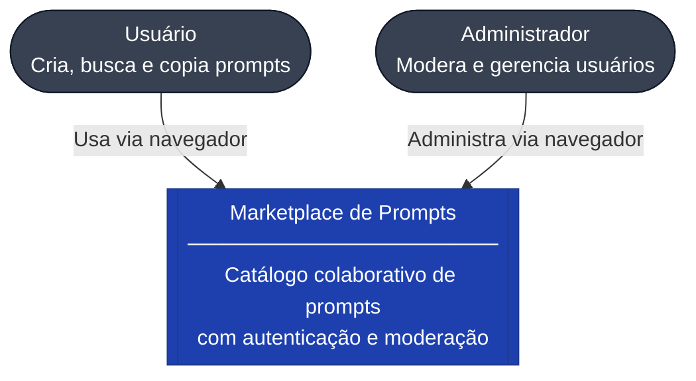

---

### Nível 2 — Containers

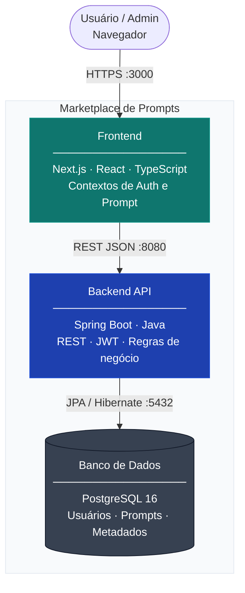

---

### Nível 3 — Componentes do Backend

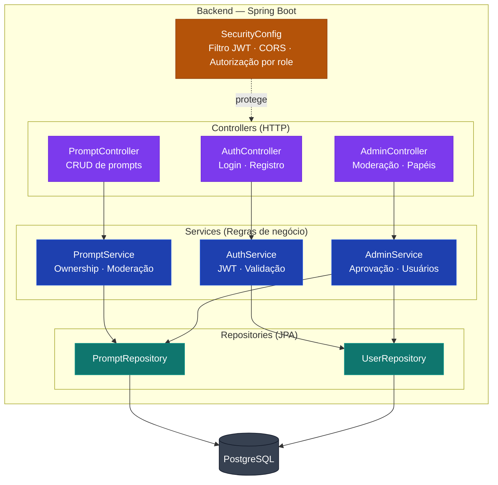

---

## Fluxo de Autenticação

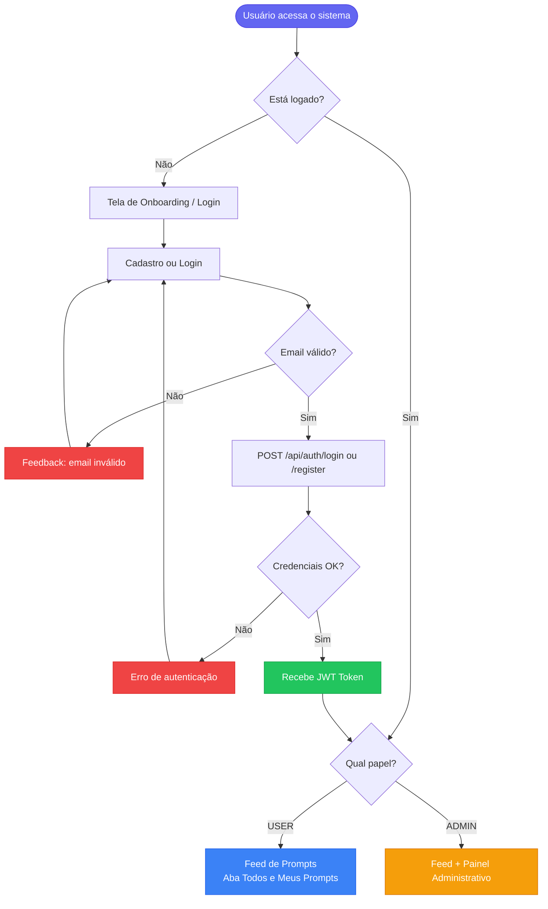

---

## Fluxo de Prompts e Moderação

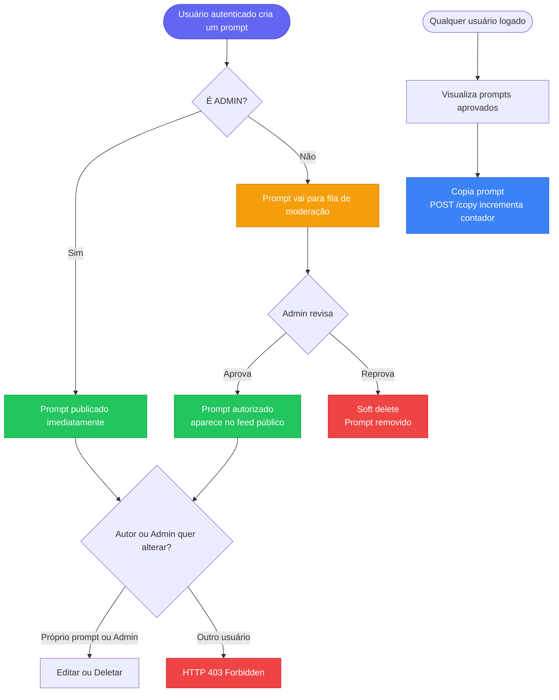

---

## Diagrama de Sequência — Criação de Prompt

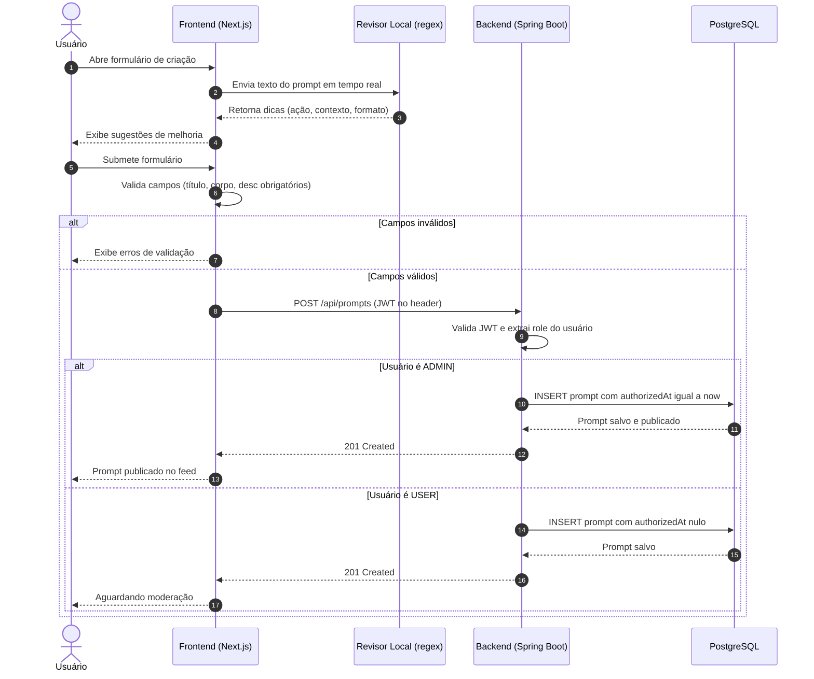

---

## Diagrama de Sequência — Moderação Admin

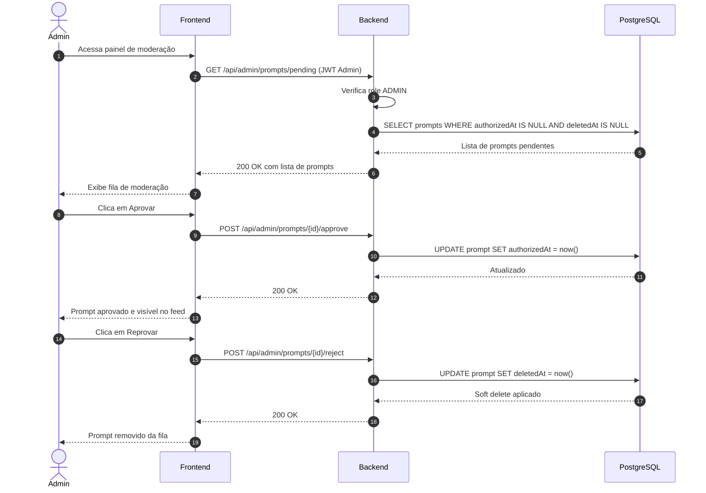

---

## Modelo de Dados

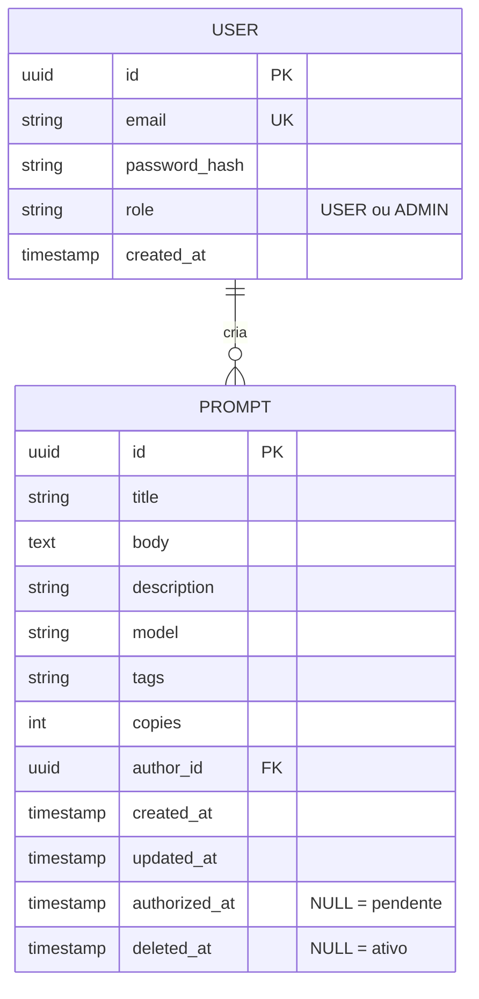

> `authorized_at = NULL` indica prompt pendente de moderação.  
> `deleted_at != NULL` indica soft delete — reprovado ou removido pelo autor/admin.

---

## API Principal

**Base URL:** `http://localhost:8080`

### Autenticação

| Método | Endpoint | Descrição |
|--------|----------|-----------|
| `POST` | `/api/auth/register` | Cadastro de novo usuário |
| `POST` | `/api/auth/login` | Login e obtenção do JWT |

### Prompts

| Método | Endpoint | Autenticação | Descrição |
|--------|----------|-------------|-----------|
| `GET` | `/api/prompts` | JWT | Lista prompts aprovados e ativos |
| `POST` | `/api/prompts` | JWT | Cria novo prompt |
| `PUT` | `/api/prompts/{id}` | JWT + owner/admin | Edita prompt existente |
| `DELETE` | `/api/prompts/{id}` | JWT + owner/admin | Remove prompt |
| `POST` | `/api/prompts/{id}/copy` | JWT | Copia e incrementa contador |

### Admin

| Método | Endpoint | Autenticação | Descrição |
|--------|----------|-------------|-----------|
| `GET` | `/api/admin/prompts/pending` | ADMIN | Lista prompts na fila de moderação |
| `POST` | `/api/admin/prompts/{id}/approve` | ADMIN | Aprova prompt |
| `POST` | `/api/admin/prompts/{id}/reject` | ADMIN | Reprova (soft delete) |
| `GET` | `/api/admin/users` | ADMIN | Lista todos os usuários |
| `PUT` | `/api/admin/users/{id}/role` | ADMIN | Altera papel do usuário |

---

## Funcionalidades

### Para todos os usuários autenticados

- Busca textual em tempo real
- Filtro por categoria/tag com autocomplete
- Paginação da listagem
- Aba **Todos** e aba **Meus Prompts**
- Tema claro e escuro
- Copiar prompt (com contador incrementado)
- Expansão do card e modal de visualização completa

### Para ADMIN

- Aprovação/reprovação de prompts pendentes
- Gestão de papéis de usuário
- Importação e exportação de prompts em Markdown

---

## Agente Revisor Local

O revisor analisa o prompt **100% no frontend**, sem chamadas externas ou chave de API.

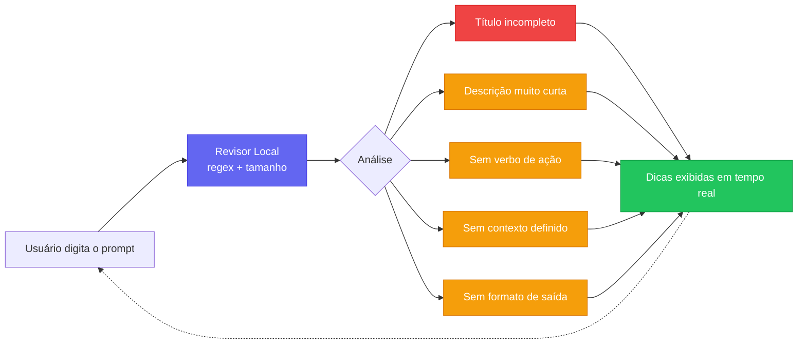

> Zero dependência de API externa. Zero custo. Zero latência de rede.

---

## Validações e Regras de Negócio

| Regra | Escopo |
|-------|--------|
| Título obrigatório | Frontend + Backend |
| Corpo obrigatório | Frontend + Backend |
| Descrição curta obrigatória (`desc`) | Frontend + Backend |
| Email válido (`@Email`) | Frontend + Backend |
| Prompt reprovado não pode ser editado | Backend |
| Usuário só altera/remove próprio prompt | Backend |
| Admin pode alterar/remover qualquer prompt | Backend |
| Cópia só incrementa para prompt autorizado e ativo | Backend |
| Acesso sem permissão retorna `HTTP 403` | Backend |

---

## Desenvolvimento Local

### Backend

```bash
cd backend
./mvnw spring-boot:run
```

### Frontend

```bash
cd frontend
npm install
npm run dev       # desenvolvimento
npm run build     # produção
```

### Testes

```bash
cd frontend
npm test
```

**Fluxo de validação manual recomendado:**

1. Cadastro e login
2. Criação com e sem descrição
3. Revisor em tempo real
4. Aba "meus prompts"
5. Moderação pelo admin
6. Regras de edição/remoção (ownership e 403)
7. Paginação e filtros por categoria

---

## Estrutura do Repositório

```
marketplace-de-prompts/
├── frontend/           # Next.js + React + TypeScript
│   ├── src/
│   │   ├── contexts/   # AuthContext, PromptContext
│   │   ├── components/ # Cards, Modal, Admin, Onboarding
│   │   └── pages/      # Rotas Next.js
│   └── Dockerfile
│
├── backend/            # Spring Boot + Java
│   ├── src/main/java/
│   │   ├── controller/ # AuthController, PromptController, AdminController
│   │   ├── service/    # Regras de negócio
│   │   ├── repository/ # JPA Repositories
│   │   └── security/   # JWT Filter, SecurityConfig
│   └── Dockerfile
│
└── docker-compose.yml  # Orquestra frontend + backend + PostgreSQL
```

---

## Troubleshooting

### Fluxo de Diagnóstico

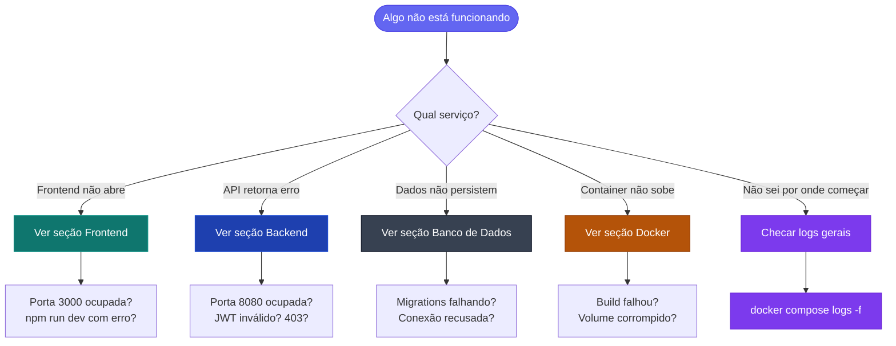

---

### Docker — Diagnóstico Geral

**Ver status de todos os containers:**
```bash
docker compose ps
```

**Ver logs de todos os serviços em tempo real:**
```bash
docker compose logs -f
```

**Ver logs de um serviço específico:**
```bash
docker compose logs -f frontend
docker compose logs -f backend
docker compose logs -f db
```

**Ver as últimas N linhas de log:**
```bash
docker compose logs --tail=100 backend
docker compose logs --tail=50 frontend
```

**Reiniciar um serviço sem derrubar os outros:**
```bash
docker compose restart backend
docker compose restart frontend
```

**Recriar containers do zero (sem cache):**
```bash
docker compose down
docker compose up --build --force-recreate -d
```

**Recriar apenas um serviço:**
```bash
docker compose up --build --force-recreate -d backend
```

**Limpar tudo, inclusive volumes (apaga dados do banco):**
```bash
docker compose down -v
docker compose up --build -d
```

**Inspecionar um container em execução:**
```bash
docker inspect marketplace-backend
docker inspect marketplace-frontend
```

**Entrar no shell de um container:**
```bash
docker compose exec backend bash
docker compose exec frontend sh
docker compose exec db psql -U postgres -d marketplace
```

---

### Frontend — Diagnóstico

**Verificar se o processo está rodando:**
```bash
# Com Docker
docker compose ps frontend

# Local
lsof -i :3000
```

**Ver logs do frontend (Docker):**
```bash
docker compose logs -f frontend
```

**Erro: porta 3000 já em uso:**
```bash
# Identificar o processo
lsof -ti :3000

# Matar o processo
kill -9 $(lsof -ti :3000)
```

**Limpar cache do Next.js e reinstalar dependências:**
```bash
cd frontend
rm -rf .next node_modules
npm install
npm run dev
```

**Checar variáveis de ambiente do frontend:**
```bash
cat frontend/.env.local
cat frontend/.env

# No container
docker compose exec frontend env | grep NEXT
```

**Build com saída detalhada para diagnóstico:**
```bash
cd frontend
npm run build 2>&1 | tee build.log
```

**Verificar se o frontend consegue alcançar o backend:**
```bash
docker compose exec frontend wget -qO- http://backend:8080/actuator/health
```

**Erros comuns e soluções:**

| Erro | Causa provável | Solução |
|------|---------------|---------|
| `ECONNREFUSED 8080` | Backend não está rodando | `docker compose restart backend` |
| `Module not found` | Dependência faltando | `npm install` |
| `Hydration error` | Divergência SSR/CSR | Limpar `.next` e reiniciar |
| `401 Unauthorized` | JWT expirado ou ausente | Fazer logout e login novamente |
| `CORS error` | Backend sem CORS configurado | Checar `SecurityConfig` no backend |

---

### Backend — Diagnóstico

**Ver logs do backend (Docker):**
```bash
docker compose logs -f backend
```

**Filtrar logs por nível:**
```bash
docker compose logs backend | grep ERROR
docker compose logs backend | grep WARN
docker compose logs backend | grep "Exception"
```

**Verificar se a porta 8080 está respondendo:**
```bash
curl -v http://localhost:8080/actuator/health
# Resposta esperada: {"status":"UP"}
```

**Testar autenticação manualmente:**
```bash
# Login e captura do token
curl -s -X POST http://localhost:8080/api/auth/login \
  -H "Content-Type: application/json" \
  -d '{"email":"admin@admin.com","password":"admin"}'

# Usar o token nas chamadas seguintes
TOKEN="cole_o_jwt_aqui"

# Listar prompts
curl -H "Authorization: Bearer $TOKEN" http://localhost:8080/api/prompts

# Listar pendentes (admin)
curl -H "Authorization: Bearer $TOKEN" http://localhost:8080/api/admin/prompts/pending
```

**Verificar conexão do backend com o banco nos logs de startup:**
```bash
docker compose logs backend | grep "HikariPool"
docker compose logs backend | grep "datasource"
docker compose logs backend | grep "Started"
```

**Erro de porta 8080 em uso:**
```bash
lsof -ti :8080
kill -9 $(lsof -ti :8080)
```

**Recompilar o backend sem Docker:**
```bash
cd backend
./mvnw clean package -DskipTests
./mvnw spring-boot:run
```

**Rodar testes e ver relatório:**
```bash
cd backend
./mvnw test
cat target/surefire-reports/*.txt
```

**Erros comuns e soluções:**

| Erro / Log | Causa provável | Solução |
|------------|---------------|---------|
| `Unable to acquire JDBC Connection` | Banco não está up | Aguardar o PostgreSQL iniciar ou `docker compose restart db` |
| `JWT expired` | Token vencido | Reautenticar o usuário |
| `403 Forbidden` | Role insuficiente ou ownership | Checar papel do usuário no banco |
| `Could not resolve placeholder` | Variável de env faltando | Verificar `application.properties` ou env do container |
| `Port 8080 already in use` | Outro processo na porta | `kill -9 $(lsof -ti :8080)` |
| `ddl-auto update failed` | Schema inconsistente | Dropar e recriar o banco (ver seção banco) |

---

### Banco de Dados — Diagnóstico

**Acessar o PostgreSQL pelo container:**
```bash
docker compose exec db psql -U postgres -d marketplace
```

**Listar tabelas:**
```sql
\dt
```

**Ver estrutura de uma tabela:**
```sql
\d prompt
\d "user"
```

**Consultar prompts pendentes de moderação:**
```sql
SELECT id, title, author_id, created_at
FROM prompt
WHERE authorized_at IS NULL
  AND deleted_at IS NULL;
```

**Consultar prompts aprovados:**
```sql
SELECT id, title, copies, authorized_at
FROM prompt
WHERE authorized_at IS NOT NULL
  AND deleted_at IS NULL
ORDER BY authorized_at DESC;
```

**Consultar todos os usuários e seus papéis:**
```sql
SELECT id, email, role, created_at
FROM "user"
ORDER BY created_at;
```

**Promover um usuário para ADMIN manualmente:**
```sql
UPDATE "user"
SET role = 'ADMIN'
WHERE email = 'usuario@exemplo.com';
```

**Verificar conexões ativas:**
```sql
SELECT pid, usename, application_name, client_addr, state
FROM pg_stat_activity
WHERE datname = 'marketplace';
```

**Ver logs do PostgreSQL:**
```bash
docker compose logs -f db
docker compose logs db | grep ERROR
docker compose logs db | grep FATAL
```

**Verificar se o banco está aceitando conexões:**
```bash
docker compose exec db pg_isready -U postgres
# Resposta esperada: /var/run/postgresql:5432 - accepting connections
```

**Conectar pelo host (sem entrar no container):**
```bash
psql -h localhost -p 5432 -U postgres -d marketplace
```

**Backup do banco:**
```bash
docker compose exec db pg_dump -U postgres marketplace > backup_$(date +%Y%m%d).sql
```

**Restaurar backup:**
```bash
docker compose exec -T db psql -U postgres marketplace < backup_20240101.sql
```

**Resetar o banco completamente (apaga todos os dados):**
```bash
docker compose down -v
docker compose up -d db
sleep 5
docker compose up -d backend frontend
```

**Erros comuns e soluções:**

| Erro | Causa provável | Solução |
|------|---------------|---------|
| `Connection refused :5432` | Container do banco não está up | `docker compose up -d db` e aguardar |
| `role "postgres" does not exist` | Volume corrompido | `docker compose down -v` e recriar |
| `relation "prompt" does not exist` | Migrations não rodaram | Reiniciar o backend para acionar o `ddl-auto` |
| `duplicate key value` | Conflito de seed | Verificar se o admin seed já existe antes de inserir |
| `FATAL: password authentication failed` | Credenciais incorretas | Verificar `POSTGRES_USER` / `POSTGRES_PASSWORD` no compose |

---

### Rede entre Containers

> Em Docker Compose os serviços se comunicam pelo **nome do serviço** definido no `docker-compose.yml` (ex: `http://backend:8080`), nunca por `localhost`.

**Verificar se os containers estão na mesma rede:**
```bash
docker network ls
docker network inspect marketplace_default
```

**Testar conectividade entre containers:**
```bash
# Do frontend para o backend
docker compose exec frontend wget -qO- http://backend:8080/actuator/health

# Ver IP de cada container
docker compose exec backend hostname -I
docker compose exec frontend hostname -I
docker compose exec db hostname -I
```

---

### Checklist de Diagnóstico Rápido

Quando algo não funciona, percorra esta ordem antes de ir mais fundo:

```
1. docker compose ps
   → Todos os containers estão "Up"?

2. docker compose logs --tail=50 <serviço>
   → Há algum ERROR ou FATAL nos logs?

3. curl http://localhost:8080/actuator/health
   → Backend responde {"status":"UP"}?

4. curl http://localhost:3000
   → Frontend responde com HTML?

5. docker compose exec db pg_isready -U postgres
   → Banco aceita conexões?

6. docker compose down && docker compose up --build -d
   → Reset completo resolve?
```

---

## Release Notes

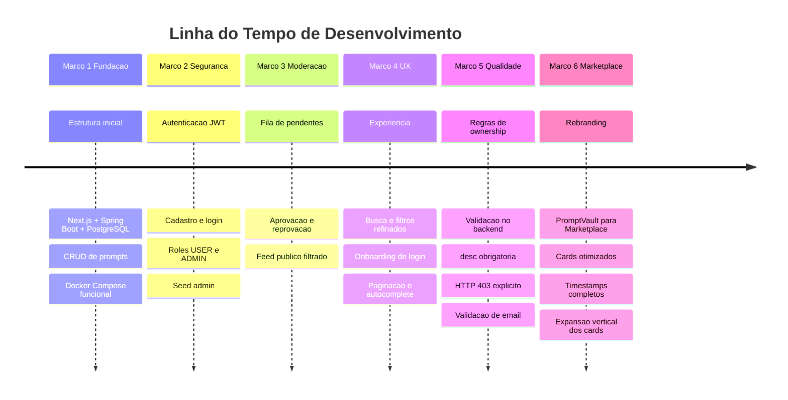

---

*Para novos colaboradores: recomendamos começar pela leitura da [Arquitetura C4](#arquitetura-c4) e do [Fluxo de Moderação](#fluxo-de-prompts-e-moderação). Adicionar uma seção `Galeria` com screenshots dos estados principais (feed, modal, admin e onboarding) facilita muito o onboarding visual.*